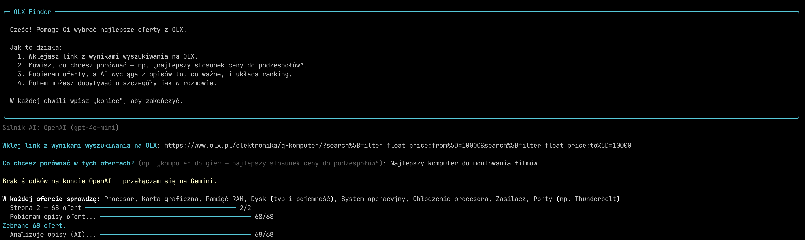
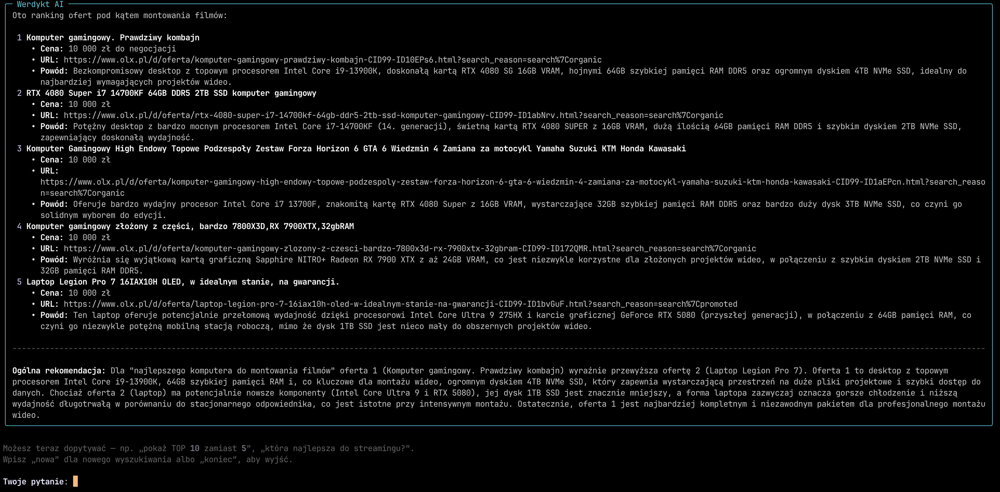

[🇵🇱 Polski](README.md) | **🇬🇧 English**

# OLX Finder


A command-line tool that helps you pick the best offer from OLX search results.
You paste a link, describe what you're looking for, and the app fetches the listings,
extracts relevant details from the descriptions using a language model (LLM), and ranks
them. You can then ask follow-up questions like in a normal conversation.

## Where it came from

It started with a mundane problem: I wanted to buy a used computer within a set budget,
but OLX had hundreds of listings, and manually comparing components from the descriptions
would have taken far too long. So I wrote a simple script that fetched the listings and
returned the best deals.

Over time the script grew into a tool that isn't limited by code to a single category —
because it's the language model that decides what to look for. For a computer it'll pick
out CPU, GPU, and RAM on its own; for a jacket, material and size.

## What it does

- Fetches all result pages from the given link, along with the full listing descriptions.
- Figures out on its own which features are worth comparing, based on your goal.
- Extracts those features from the descriptions and builds a ranking of the best-matching offers.
- Lets you ask follow-up questions about the results already returned.

## Example





## How it works

The app walks you through four stages:

1. **Plan** — the LLM gets your goal and the link, then returns a list of features to
   compare (e.g. for a computer: CPU, GPU, RAM, storage).
2. **Fetching** — Selenium collects listings from all result pages and opens each one for
   its full description.
3. **Extraction** — descriptions go to the model in batches, which returns structured data
   (JSON) with values for each feature.
4. **Ranking & questions** — based on the collected data, the LLM builds a ranking and
   answers follow-up questions within the same session, keeping context.

The LLM provider and the auction site are hidden behind shared interfaces (`LLMClient`,
`OlxScraper`), so adding another model or another marketplace comes down to writing one
class — the rest of the flow stays unchanged.

```text
olx_finder/
  config.py     settings loaded from .env
  models.py     shared data structures (Offer, AnalysisPlan)
  scraper.py    fetches OLX listings via Selenium
  ai.py         OpenAI and Gemini clients behind one interface, with retries
  prompts.py    prompts for each stage
  analyzer.py   plan -> batched feature extraction -> Q&A session
  cli.py        interactive terminal flow
```

## Requirements

- Python 3.10+
- Google Chrome (Selenium drives it in the background)
- An API key for one of the LLMs — Google Gemini (free) or OpenAI

## Installation

```bash
git clone https://github.com/Adrian-Wiszowaty/olx-finder.git
cd olx-finder
python -m venv .venv && source .venv/bin/activate
pip install -e .
cp .env.example .env
```

Open `.env` and paste your API key. Get a free Gemini key at
<https://aistudio.google.com/apikey>.

## Running

```bash
olx-finder
```

Then just follow the prompts: paste an OLX search results link, describe what you want to
compare, and browse the ranking. You can ask follow-ups (*"show top 10"*, *"which one's the
quietest?"*), type `nowa` (Polish for "new") to start a new search, or `koniec` (Polish for
"end") to quit.

The most common options can also be given as flags, which override the settings from `.env`:

```bash
olx-finder --provider openai
```

## Configuration

Settings are kept in `.env` (template in `.env.example`):

| Variable | Default | Description |
|---|---|---|
| `GEMINI_API_KEY` | — | Google Gemini key (free tier available) |
| `OPENAI_API_KEY` | — | OpenAI key |
| `LLM_PROVIDER` | auto | Forces a provider: `gemini` or `openai`. When both keys are set, OpenAI is chosen by default |

There are also less commonly needed variables (`MAX_PAGES`, `HEADLESS`, `OPENAI_MODEL`,
`GEMINI_MODEL`) — see `config.py` for details.

## Tests

```bash
pip install pytest
pytest
```

## License

MIT — see [LICENSE](LICENSE).
