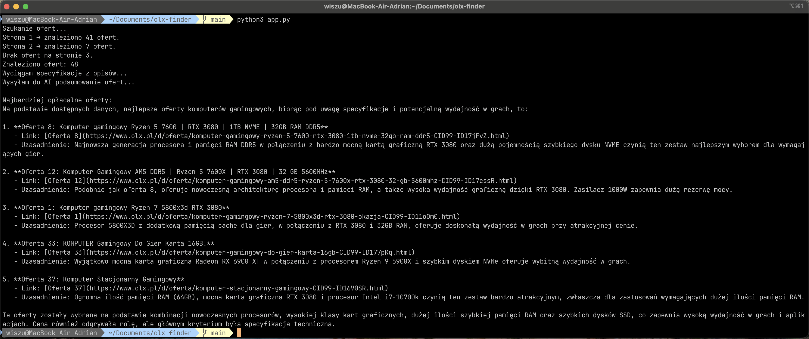

## Opis
OLX Finder to narzędzie do automatycznego wyszukiwania, ekstrakcji i porównywania ofert komputerów gamingowych z serwisu OLX. Pozwala na pobranie ofert, wyciągnięcie specyfikacji technicznej z opisów oraz porównanie ich z użyciem AI (OpenAI).

## Najważniejsze funkcjonalności
- Automatyczne pobieranie ofert z OLX (selenium)
- Ekstrakcja specyfikacji z opisów ofert (AI)
- Porównywanie ofert i wybór najlepszych (AI)
- Konfigurowalne parametry wyszukiwania w pliku `config.py`

## Wymagania
- Python 3.10+
- selenium
- webdriver-manager
- openai

## Instalacja
```bash
git clone https://github.com/Adrian-Wiszowaty/olx-finder.git
cd olx-finder
pip install selenium webdriver-manager openai
```

## Konfiguracja
Uzupełnij swój klucz OpenAI API w pliku `config.py`:
```python
OPENAI_API_KEY = "sk-..."
```
W przeglądarce wybierz interesujące Cię filtry na stronie OLX, a nastepnie wklej link do stałej OLX_BASE_URL.

## Uruchomienie
```bash
python app.py
```

## Przykład działania
Po uruchomieniu program:
1. Pobiera oferty komputerów z OLX (wg kryteriów z `config.py`)
2. Wyciąga specyfikacje z opisów (AI)
3. Porównuje oferty i wypisuje 5 najlepszych (AI)

## Zrzuty ekranu


## Technologie
- Python 3
- Selenium, webdriver-manager
- OpenAI API (GPT-4)

## Licencja
MIT
