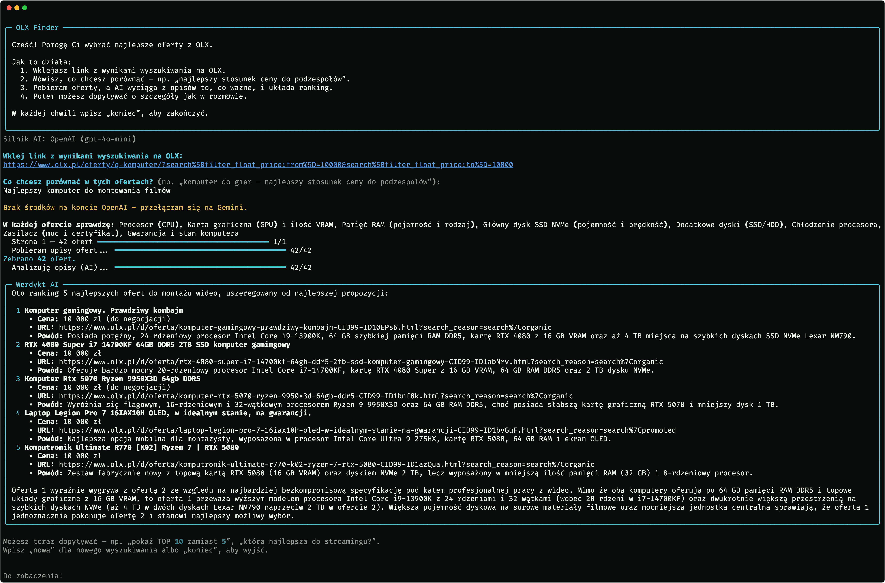

**🇵🇱 Polski** | [🇬🇧 English](README.en.md)

# OLX Finder


Narzędzie wiersza poleceń, które pomaga wybrać najlepszą ofertę z wyników wyszukiwania OLX.
Wklejasz link, opisujesz czego szukasz, a aplikacja pobiera ogłoszenia, wyciąga z opisów
istotne parametry za pomocą modelu językowego (LLM) i układa z nich ranking. Potem możesz
dopytywać o szczegóły jak w zwykłej rozmowie.

## Skąd pomysł

Zaczęło się od prozaicznego problemu: chciałem kupić używany komputer w określonym budżecie,
ale na OLX było kilkaset ofert i ręczne porównywanie podzespołów z
opisów zajełoby zbyt dużo czasu. Napisałem więc prosty skrypt, który pobierał ogłoszenia i zwracał najkorzystniejsze aukcje.

Z czasem skrypt rozrósł się w narzędzie, które nie jest ograniczone kodem do jednej kategorii — bo to
model językowy decyduje, na co zwrócić uwagę. Dla komputera sam wybierze procesor, kartę
graficzną i pamięć a dla kurtki materiał i rozmiar.

## Co potrafi

- Pobiera wszystkie strony wyników z podanego linku, razem z pełnymi opisami ogłoszeń.
- Sam ustala, jakie cechy warto porównać — na podstawie Twojego celu.
- Wyciąga te cechy z opisów i buduje ranking ofert najlepiej pasujących do tego, czego szukasz.
- Pozwala dopytywać o już zwrócone wyniki.

## Przykład



## Jak to działa

Aplikacja prowadzi cię przez cztery etapy:

1. **Plan** — LLM dostaje Twój cel i link, po czym zwraca listę cech do porównania
   (np. dla komputera: CPU, GPU, RAM, dysk).
2. **Pobieranie** — Selenium zbiera ogłoszenia ze wszystkich stron wyników i wchodzi w każde
   po pełny opis.
3. **Ekstrakcja** — opisy trafiają do modelu w paczkach, a ten zwraca ustrukturyzowane dane
   (JSON) z wartościami poszczególnych cech.
4. **Ranking i pytania** — na podstawie zebranych danych LLM układa ranking i odpowiada na
   kolejne pytania w obrębie jednej sesji, pamiętając kontekst.

Dostawca LLM i serwis aukcyjny są schowane za wspólnymi interfejsami (`LLMClient`,
`OlxScraper`), więc dołożenie innego modelu albo kolejnego portalu sprowadza się do napisania
jednej klasy — reszta przepływu zostaje bez zmian.

```text
olx_finder/
  config.py     ustawienia wczytywane z .env
  models.py     wspólne struktury danych (Offer, AnalysisPlan)
  scraper.py    pobieranie ogłoszeń z OLX przez Selenium
  ai.py         klienci OpenAI i Gemini za jednym interfejsem, z ponawianiem zapytań
  prompts.py    prompty dla każdego etapu
  analyzer.py   plan -> ekstrakcja cech w paczkach -> sesja pytań i odpowiedzi
  cli.py        interaktywny przepływ w terminalu
```

## Wymagania

- Python 3.10+
- Google Chrome (Selenium steruje nim w tle)
- Klucz API do jednego z LLM-ów — Google Gemini (darmowy) lub OpenAI

## Instalacja

```bash
git clone https://github.com/Adrian-Wiszowaty/olx-finder.git
cd olx-finder
python -m venv .venv && source .venv/bin/activate
pip install -e .
cp .env.example .env
```

Otwórz `.env` i wklej klucz API. Darmowy klucz Gemini wygenerujesz na
<https://aistudio.google.com/apikey>.

## Uruchomienie

```bash
olx-finder
```

Dalej wystarczy iść za instrukcjami: wklejasz link z wynikami OLX, opisujesz co chcesz
porównać i przeglądasz ranking. Możesz dopytywać (*„pokaż top 10"*, *„który najcichszy?"*),
wpisać `nowa`, żeby zacząć kolejne wyszukiwanie, albo `koniec`, żeby wyjść.

Najczęstsze opcje można też podać jako flagi, które nadpisują ustawienia z `.env`:

```bash
olx-finder --provider openai --max-offers 20
```

## Konfiguracja

Ustawienia trzymane są w `.env` (wzór w `.env.example`):

| Zmienna | Domyślnie | Opis |
|---|---|---|
| `GEMINI_API_KEY` | — | Klucz Google Gemini (dostępny darmowy poziom) |
| `OPENAI_API_KEY` | — | Klucz OpenAI |
| `LLM_PROVIDER` | auto | Wymusza dostawcę: `gemini` lub `openai`. Gdy oba klucze są ustawione, domyślnie wybierany jest OpenAI |
| `MAX_OFFERS` | bez limitu | Ogranicza liczbę pobranych ofert — przydatne do szybkich testów |

Dostępne są też rzadziej potrzebne zmienne (`MAX_PAGES`, `HEADLESS`, `OPENAI_MODEL`,
`GEMINI_MODEL`) — szczegóły w `config.py`.

## Testy

```bash
pip install pytest
pytest
```

## Licencja

MIT — szczegóły w [LICENSE](LICENSE).
